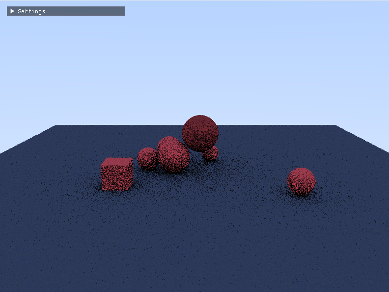

# GPU-Accelerated Physics Engine

A high-performance physics engine for robotics and VR simulations, built entirely on GPU using Taichi.



## Overview

This project implements a realistic physics simulation system designed for:
- **Robotics** - Accurate collision detection and physics for robotic manipulation (1mm precision)
- **VR Applications** - Real-time interactive physics simulations
- **Research** - Experimenting with GPU-accelerated physics algorithms

## Current Features

- **GPU-First Architecture** - All physics computations run on GPU using Taichi
- **Path Tracing Renderer** - Real-time visualization with BVH acceleration
- **Rigid Body Dynamics** - Full 6-DOF physics with rotation and translation
- **Collision Detection**
  - Broad phase (N² for now, BVH planned)
  - Narrow phase with SAT (Separating Axis Theorem)
  - Sphere, Box, and Plane primitives
- **Contact Solver** - Sequential impulse solver with Baumgarte stabilization
- **Mesh Loading** - OBJ file support with GPU-side transformation (for now without collisions)

## Future Roadmap

### Performance
- [ ] Faster collision detection algorithms
- [ ] GPU BVH for broad phase
- [ ] Parallel constraint solver

### Realism
- [ ] Per-material properties (friction, restitution, density)
- [ ] Soft body dynamics
- [ ] Improved contact modeling

### Complex Geometry
- [ ] CoACD integration for convex decomposition
- [ ] Multi-level collision accuracy (single hull → decomposed → SDF)
- [ ] Signed Distance Fields (SDF) for exact non-convex collision

## Technical Details

**Physics Solver**: Sequential impulse method with contact constraint resolution
**Rendering**: GPU path tracer with LBVH acceleration structure
**Language**: Python + Taichi (JIT-compiled to GPU kernels)
**Target**: Real-time performance for VR (60+ FPS)

## Project Structure

```
kernels/
  ├── data.py           # GPU data structures
  ├── physics.py        # Collision detection and dynamics
  ├── bvh.py            # BVH construction (LBVH)
  ├── raytracing.py     # Path tracing renderer
  └── mesh_processor.py # Collision strategy selector
main.py                 # Scene setup and main loop
```

## Running

```bash
python main.py [--raytrace - instead of rasterizing it will render using path tracing]  
```

Controls:
- Mouse + Drag: Rotate camera
- Scroll: Zoom
- Arrow keys: Pan camera

## License

Personal hobby project - feel free to learn from it!