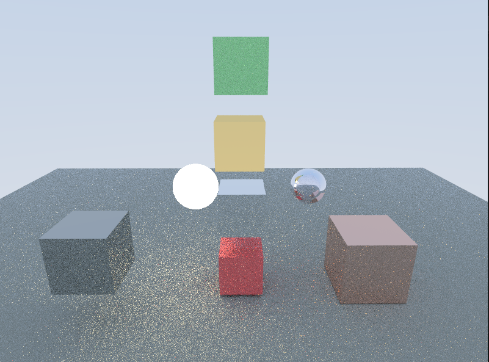

# GPU-Accelerated Physics Engine

A real-time rigid body physics engine with all simulation and rendering running on the GPU via Vulkan compute shaders, written in Zig.



## Overview

This project implements a realistic physics simulation system designed for:
- **Robotics** - Accurate collision detection and physics for robotic manipulation
- **VR Applications** - Real-time interactive physics simulations
- **Research** - Experimenting with GPU-accelerated physics algorithms

## Features

- **GPU-First Architecture** - All physics and rendering run as Vulkan compute shaders
- **Rigid Body Dynamics** - Full 6-DOF physics with quaternion rotation
- **Collision Detection**
  - Broad phase with AABB (parallel cascaded reduce)
  - Narrow phase with GJK + EPA
  - Box and Sphere primitives with convex hull support
- **Contact Solver** - PGS (Projected Gauss-Seidel) with Baumgarte stabilization, friction, and restitution
- **Per-material properties** - Friction, restitution, density, albedo, roughness, metallic, emission, IOR
- **Rendering Modes**
  - Rasterization (default)
  - Path tracing with BVH acceleration (LBVH with radix sort)
- **ImGui overlay** - Real-time debug UI (optional)

## Building

### Dependencies

- Zig compiler
- Vulkan SDK
- GLFW
- shaderc (runtime shader compilation)

### Build & Run

```bash
# Default: raster mode with ImGui
zig build run

# Path tracing mode
zig build run -Dmode=raytrace

# Without ImGui
zig build run -Dimgui=false

# Release build
zig build run -Doptimize=ReleaseFast
```

## Controls

- **WASD** - Move camera
- **Mouse** - Look around

## Project Structure

```
src/
  ├── main.zig          # Scene setup and main loop
  ├── data.zig          # GPU buffer management and scene data
  ├── physics.zig       # Physics pipeline dispatch
  ├── bvh.zig           # BVH construction dispatch
  ├── raytracer.zig     # Path tracer dispatch
  ├── vulkan.zig        # Vulkan context and helpers
  ├── scene.zig         # Swapchain, render pass, drawing
  ├── camera.zig        # FPS camera
  ├── profiler.zig      # CPU/GPU timing profiler
  ├── gui.zig           # ImGui integration
  └── shaders/
      ├── physics.comp  # Physics compute shader (gravity, AABB, broadphase, GJK/EPA, PGS, integration)
      ├── bvh.comp      # LBVH build (centroids, morton codes, radix sort, tree construction)
      └── raytrace.comp # Path tracer (BVH traversal, PBR materials, glass/metal/diffuse)
build.zig               # Build configuration
```

## Technical Details

- **Physics Solver**: PGS with 30 iterations, 10 substeps at 60Hz
- **Rendering**: Vulkan rasterization or GPU path tracer with 16 SPP, 16 bounces
- **BVH**: Linear BVH built per-frame via parallel radix sort on Morton codes
- **Profiling**: Built-in per-step GPU profiler with min/avg/max/recent timing

## TODO

### Optimization
- [ ] Parallel PGS solver (currently single-threaded on GPU)
- [ ] Broad phase acceleration (sort-and-sweep or BVH instead of N^2)
- [ ] GPU timestamp queries instead of CPU-side submit+wait profiling

### Features
- [ ] Mesh loading (OBJ/glTF) with convex decomposition for collision
- [ ] Soft body dynamics (FEM or position-based dynamics)
- [ ] Fluid simulation (SPH or FLIP)
- [ ] Joints and constraints (hinge, slider, fixed)
- [ ] Scene serialization (save/load)

## License

Personal hobby project - feel free to learn from it!
